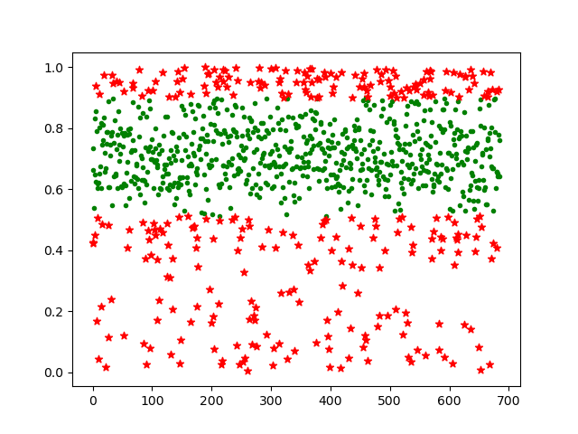
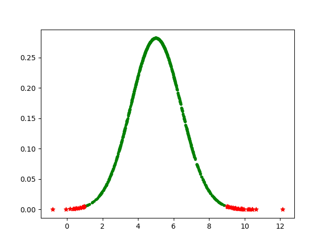

# Machine-Learning-Unsupervised
Unspervised algorithms that I really like. I don't think I will have all of them. So just the ones I like. Also no libraries will be used other than maybe numpy and pandas, all code will be written in Python.

## Outliers:

Check out some of the machine learning algorithms for outlier detection.

1. simple numeric outlier: is a very simple outlier selection algorithm which uses the concept of Quartiles to detect Outliers. Take a look at the 'numeric_outlier.png' which shows us the accuracy of against k ranging from [0,1].
Here is a link to its explaination: https://xorbians.wixsite.com/xorbians/post/simple-numeric-outlier

2. Z-Score: is very simple yet powerful tool, used for Outlier Selection in Parametric Datsets especially those which have a Gaussian Distribution. It is easy to implement and understand. Here is a link to its explaination: https://xorbians.wixsite.com/xorbians/post/z-score-outlier-detection

### 1. simple numeric outlier: 
Is a very simple outlier selection algorithm which uses the concept of Quartiles to detect Outliers. Take a look at the 'numeric_outlier.png' which shows us the accuracy of against k ranging from [0,1].
Here is a link to its explaination: https://xorbians.wixsite.com/xorbians/post/simple-numeric-outlier

### 2. Z-Score: 
A simple yet powerful outlier selection algorithm which uses the concept of Gaussian Distributions to detect Outliers.
Here is a link to its explaination: https://xorbians.wixsite.com/xorbians/post/z-score-outlier-detection

